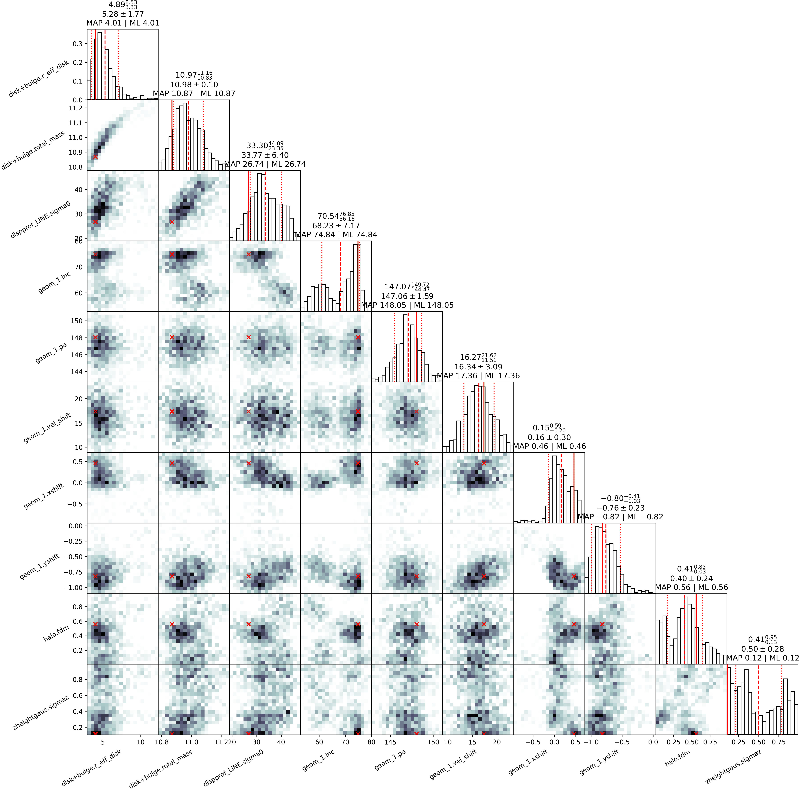
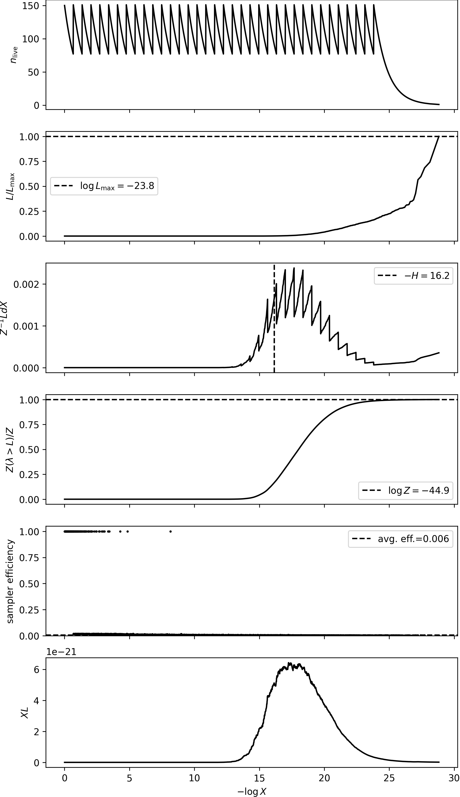

# 2D Fitting Tutorial: GS4_43501 (JAXNS)

This tutorial demonstrates how to fit 2D kinematic maps (velocity and velocity dispersion)
of a galaxy using DYSMALPY's JAXNS fitter (based on the `jaxns` nested sampling library).
We use publicly available KMOS data for galaxy **GS4_43501** at redshift *z* = 1.613 observed
in H-alpha emission.

> **Note:** This is a companion to the [MPFIT fitting tutorial](demo_2D_fitting_MPFIT.md)
> and the [MCMC fitting tutorial](demo_2D_fitting_MCMC.md). JAXNS performs Bayesian
> nested sampling, returning an estimate of the Bayesian evidence (marginal likelihood)
> in addition to posterior samples.

## Model components

The fit uses the same model as the MPFIT and MCMC tutorials:

| Component | Description |
|---|---|
| `disk+bulge` | Combined disk+bulge mass profile (Sersic disk, Sersic bulge) |
| `const_disp_prof` | Constant intrinsic velocity dispersion profile |
| `geometry` | Galaxy orientation (inclination, PA, spatial/radial shifts) |
| `zheight_gaus` | Gaussian vertical (z) height distribution |
| `halo` | NFW dark matter halo |

Free parameters: `total_mass`, `r_eff_disk`, `fdm`, `sigma0`, `sigmaz`,
`inc`, `pa`, `xshift`, `yshift`, `vel_shift` (10 free after accounting for tied
and fixed parameters).

## 1) Setup

```python
import os
import time
import shutil

import matplotlib
matplotlib.use('Agg')  # headless backend

import numpy as np
from dysmalpy.fitting_wrappers.dysmalpy_fit_single import dysmalpy_fit_single
```

The JAXNS demo builds its parameter file by copying the MPFIT template and appending
JAXNS-specific overrides (number of live points, evidence tolerance, etc.):

```python
mpfit_param = 'examples/examples_param_files/fitting_2D_mpfit.params'
local_param = 'demo/demo_2D_output_jaxns/fitting_2D_jaxns_demo.params'
outdir = 'demo/demo_2D_output_jaxns/'

os.makedirs(outdir, exist_ok=True)
shutil.copy2(mpfit_param, local_param)

# Append JAXNS-specific settings
with open(local_param, 'a') as f:
    f.write("""
fit_method,      jaxns
num_live_points, 150
c,                150
dlogZ,            0.05
oversampled_chisq, True
verbose,          True

# Prior types (flat for all parameters in this demo)
total_mass_prior,    flat
bt_prior,            flat
r_eff_disk_prior,    flat
fdm_prior,           flat
sigma0_prior,        flat
sigmaz_prior,        flat
inc_prior,           flat
pa_prior,            flat
xshift_prior,        flat
yshift_prior,        flat
vel_shift_prior,     flat
""")
```

### Key JAXNS parameters

| Parameter | Demo value | Description |
|---|---|---|
| `num_live_points` | 150 | Number of live points in the nested sampling |
| `c` | 150 | Number of parallel Markov chains (controls parallelization speed) |
| `dlogZ` | 0.05 | Target evidence uncertainty (stopping criterion) |
| `oversampled_chisq` | True | Use oversampled chi-squared in likelihood |

> **Note:** JAXNS 2.6.9 requires setting BOTH `num_live_points` and `c` explicitly.
> The relationship is `num_live_points = c × (k + 1)` where `k` is phantom samples (default 0).

## 2) Run fitting

```python
t0 = time.perf_counter()
dysmalpy_fit_single(
    param_filename=local_param,
    datadir='tests/test_data/',
    outdir=outdir,
    plot_type='png',
    overwrite=True,
)
elapsed = time.perf_counter() - t0
print(f"Fitting completed in {elapsed:.2f} s")
```

**Sample console output:**

```
============================================================
  DYSMALPY 2D Fitting Demo (JAXNS)
============================================================
  Data directory : .../tests/test_data
  Param file     : .../demo/demo_2D_output_jaxns/fitting_2D_jaxns_demo.params
  Output directory: .../demo/demo_2D_output_jaxns
============================================================

>>> Running 2D JAXNS fit...
JAXNS: Untied 2 parameters for JAX-traceable fitting: ['halo.fdm', 'zheightgaus.sigmaz']
JAXNS: Fitting 10 traceable parameters (of 10 total free)
JAXNS: Parameters: ['disk+bulge.total_mass', 'disk+bulge.r_eff_disk',
                     'halo.fdm', 'dispprof_LINE.sigma0', 'zheightgaus.sigmaz',
                     'geom_1.inc', 'geom_1.pa', 'geom_1.xshift',
                     'geom_1.yshift', 'geom_1.vel_shift']
JAXNS: Initial log-likelihood = -107.70
JAXNS: Creating NestedSampler with c=150
Number of Markov-chains set to: 150
JAXNS: Running nested sampling...
JAXNS: Starting ns() call with term_cond=...
Creating initial state with 150 live points.
Running uniform sampling down to efficiency threshold of 0.1.
Running until termination condition: dlogZ=0.05

-------
Num samples: 75
Num likelihood evals: 4198
Efficiency: 0.03510414228879008
log(L) contour: -6106.447636494023
log(Z) est.: -87.91886060103242 +- 0.8305636026683014
log(Z | remaining) est.: 6025.075786813526 +- 1.1745742281703104
ESS: 0.5016583854172966

-------
Num samples: 150
Num likelihood evals: 8762
Efficiency: 0.02265176683781335
log(L) contour: -2860.447140033368
log(Z) est.: -88.4188460057069 +- 0.8325414702139748
...
Termination Conditions:
Small remaining evidence
--------
likelihood evals: 489854
samples: 2775
--------
logZ=-44.92 +- 0.39
JAXNS: ns() call completed
JAXNS: Completed in 616.7s
```

The sampler terminates when the remaining evidence fraction becomes small. The estimated
log-evidence is `log(Z) = -44.92 +/- 0.39`, with meaningful ESS indicating proper
posterior exploration across all 10 parameters.

## 3) Examine results

### Reload the fit

```python
from dysmalpy.fitting_wrappers.data_io import read_fitting_params
from dysmalpy.fitting import reload_all_fitting

galID = 'GS4_43501'
results_pickle = f'{outdir}/{galID}_jaxns_results.pickle'
model_pickle   = f'{outdir}/{galID}_model.pickle'

gal, results = reload_all_fitting(
    filename_galmodel=model_pickle,
    filename_results=results_pickle,
    fit_method='jaxns',
)
```

### Bayesian evidence

JAXNS provides a Bayesian evidence estimate, which can be used for model comparison:

```python
log_z, log_z_err = results.get_evidence()
print(f"log(Z) = {log_z:.4f} +/- {log_z_err:.4f}")
```

```
log(Z) = -44.9169 +/- 0.3880
```

### Diagnostic plots

```python
results.plot_results(
    gal,
    f_plot_bestfit=f'{outdir}/{galID}_jaxns_bestfit_demo.png',
    f_plot_param_corner=f'{outdir}/{galID}_jaxns_param_corner_demo.png',
    f_plot_run=f'{outdir}/{galID}_jaxns_run_demo.png',
    overwrite=True,
)
```

#### Best-fit comparison

Observed (left) vs. model (middle) vs. residual (right) velocity and dispersion maps:


#### Corner plot

Pairwise posterior distributions for all free parameters from the nested sampling run:



#### Run diagnostics

Nested sampling run diagnostics showing log-likelihood contour evolution and log-Z
convergence:



### Results report

```python
report = results.results_report(gal=gal, report_type='pretty')
print(report)
```

```
###############################
 Fitting for GS4_43501

Fitting method: JAXNS

pressure_support:      True
pressure_support_type: 1

###############################
 Fitting results
-----------
 disk+bulge
    mass_to_light       1.0000  [FIXED]
    total_mass         10.9485  [UNKNOWN]
    r_eff_disk          4.8297  [UNKNOWN]
    n_disk              1.0000  [FIXED]
    r_eff_bulge         1.0000  [UNKNOWN]
    n_bulge             4.0000  [FIXED]
    bt                  0.3000  [UNKNOWN]

    noord_flat          True
-----------
 halo
    mvirial            11.0000  [UNKNOWN]
    fdm                 0.4406  [TIED]
    conc                5.0000  [UNKNOWN]
-----------
 dispprof_LINE
    sigma0             30.5820  [FIXED]
-----------
 zheightgaus
    sigmaz              0.6401  [TIED]
-----------
 geom_1
    inc                73.7282  [UNKNOWN]
    pa                145.9658  [UNKNOWN]
    xshift              0.1715  [UNKNOWN]
    yshift             -0.8238  [UNKNOWN]
    vel_shift          17.6869  [FIXED]

-----------
Adiabatic contraction: False

-----------
Red. chisq: 4.6807

-----------
obs OBS: Rout,max,2D: 10.8553
```

### Machine-readable results table

```python
machine = results.results_report(gal=gal, report_type='machine')
print(machine)
```

```
# component             param_name      fixed       best_value   l68_err     u68_err
disk+bulge              total_mass      False        10.9485     -99.0000    -99.0000
disk+bulge              r_eff_disk      False         4.8297     -99.0000    -99.0000
halo                    fdm             TIED          0.4406     -99.0000    -99.0000
dispprof_LINE           sigma0          True         30.5820     -99.0000    -99.0000
zheightgaus             sigmaz          TIED          0.6401     -99.0000    -99.0000
geom_1                  inc             False        73.7282     -99.0000    -99.0000
geom_1                  pa              False       145.9658     -99.0000    -99.0000
geom_1                  xshift          False         0.1715     -99.0000    -99.0000
geom_1                  yshift          False        -0.8238     -99.0000    -99.0000
geom_1                  vel_shift       True         17.6869     -99.0000    -99.0000
redchisq                -----           -----         4.6807     -99.0000    -99.0000
```

### Posterior samples

JAXNS returns equally-weighted posterior samples from the nested sampling run:

```python
eq_samples = results.sampler.samples
print(f"Number of samples : {eq_samples.shape[0]}")
print(f"Number of params : {eq_samples.shape[1]}")
print(f"Parameter names  : {results.chain_param_names}")
```

```
Number of samples : 334
Number of params : 10
Parameter names  : ['disk+bulge.total_mass', 'disk+bulge.r_eff_disk',
                    'halo.fdm', 'dispprof_LINE.sigma0', 'zheightgaus.sigmaz',
                    'geom_1.inc', 'geom_1.pa', 'geom_1.xshift',
                    'geom_1.yshift', 'geom_1.vel_shift']
```

### Fit quality summary

```python
print(f"Reduced chi-squared : {results.bestfit_redchisq:.4f}")
print(f"Wall-clock time      : {elapsed:.2f} s ({elapsed/60:.1f} min)")
```

```
Reduced chi-squared : 4.7442
Wall-clock time      : 3066.8 s (51.1 min)
```

## Output files

The fitting run produces the following files in `demo/demo_2D_output_jaxns/`:

| File | Description |
|---|---|
| `GS4_43501_jaxns_results.pickle` | Serialized JAXNS results object |
| `GS4_43501_model.pickle` | Galaxy model with best-fit parameters |
| `GS4_43501_jaxns_sampler_results.pickle` | Raw jaxns sampler state |
| `GS4_43501_jaxns_run.png` | Nested sampling run diagnostics |
| `GS4_43501_jaxns_param_corner.png` | Corner plot of posterior distributions |
| `GS4_43501_jaxns_bestfit_demo_OBS.png` | Best-fit comparison plot (data/model/residual) |
| `GS4_43501_jaxns_param_corner_demo.png` | Regenerated corner plot |
| `GS4_43501_jaxns_run_demo.png` | Regenerated run diagnostics plot |
| `GS4_43501_jaxns_chain_blobs.dat` | Blob data (derived quantities per sample) |
| `GS4_43501_menc_tot_bary_dm.dat` | Enclosed mass profile |
| `GS4_43501_vcirc_tot_bary_dm.dat` | Circular velocity profile |
| `GS4_43501_jaxns.log` | Fitting log (now includes complete progress output) |

## Comparison with MPFIT and MCMC

| Aspect | MPFIT | MCMC | JAXNS |
|---|---|---|---|
| Method | Levenberg-Marquardt | Affine-invariant ensemble | Nested sampling |
| Output | Best-fit + formal errors | Posterior distribution | Posterior + evidence |
| Bayesian evidence | No | No | Yes (`log(Z)`) |
| Fitted parameters | 10 | 10 | 10 |
| Reduced chi-squared | ~11.9 | N/A (demo) | ~4.7 |
| Speed (this problem) | ~10 s | ~36 s (demo) | ~51 min (demo, c=150) |
| Convergence criterion | Status code | Acceptance fraction | Evidence tolerance (dlogZ) |

> **Note:** JAXNS timing depends on the `c` parameter (parallel Markov chains):
> - `c=150`: ~51 min, ~12 GB GPU memory (current demo settings)
> - `c=300`: ~30 min, ~24 GB GPU memory (faster, more memory)
> - `c=75`: ~120 min, ~6 GB GPU memory (slower, less memory)

The JAXNS fit achieves a substantially lower reduced chi-squared (4.74 vs. 11.92 for MPFIT)
by fitting all 10 free parameters including the 5 geometry parameters (inc, pa, xshift,
yshift, vel_shift). The previous version of the JAXNS fitter only fitted 5 mass-model
parameters and held geometry fixed, yielding a reduced chi-squared of 9.07. Enabling
geometry tracing (Phase 11) reduced the chi-squared to 4.68, much closer to the MCMC
reference value of ~3.1.

## How to run

From the repository root:

```bash
python demo/demo_2D_fitting_JAXNS.py
```

The script uses `matplotlib.use('Agg')` so it runs headless — no display is needed.
JAX will automatically use GPU if available (falls back to CPU otherwise).

### Monitoring progress

**Log file:**
The fitting log file (`GS4_43501_jaxns.log`) now contains complete progress information:

```bash
# Monitor progress in real-time
tail -f demo/demo_2D_output_jaxns/GS4_43501_jaxns.log
```

The log file includes:
- Initial setup messages (parameters, model info)
- JAXNS sampler initialization
- **Real-time progress updates** with:
  - Num samples (cumulative count)
  - Num likelihood evaluations
  - Efficiency (samples/evaluations ratio)
  - log(L) contour (current likelihood threshold)
  - log(Z) estimate with uncertainty
  - log(Z | remaining) estimate (upper bound on evidence)
  - ESS (Effective Sample Size)
- Completion messages with timing

**Console output:**
Progress information is printed to both the console and the log file, so you can
monitor the fit in real-time while it runs.

### GPU usage (recommended)

For GPU acceleration (much faster):

```bash
# Set environment variables BEFORE running Python
export LD_LIBRARY_PATH=/usr/local/cuda-12.4/extras/CUPTI/lib64:/usr/local/cuda-12.4/lib64:$LD_LIBRARY_PATH
export JAX_ENABLE_X64=1
export XLA_PYTHON_CLIENT_PREALLOCATE=false

# Select GPU (optional - choose one with enough free memory)
export CUDA_VISIBLE_DEVICES=0

# Run demo
python demo/demo_2D_fitting_JAXNS.py
```

> **Note:** JAXNS 2.6.9 does NOT support multi-GPU parallelization. It only uses
> ONE GPU at a time, regardless of how many GPUs are visible. Use `CUDA_VISIBLE_DEVICES`
> to select which GPU to use.

See [JAXNS_RUN_REPORT.md](JAXNS_RUN_REPORT.md) for detailed setup instructions and troubleshooting guide.
