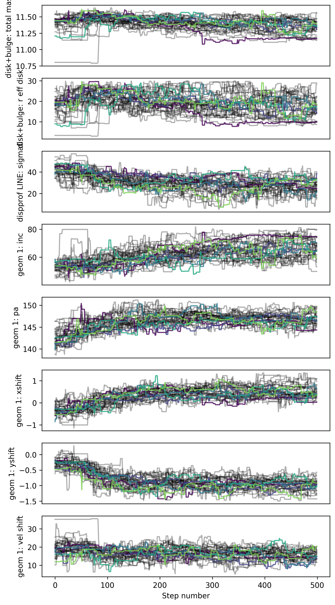
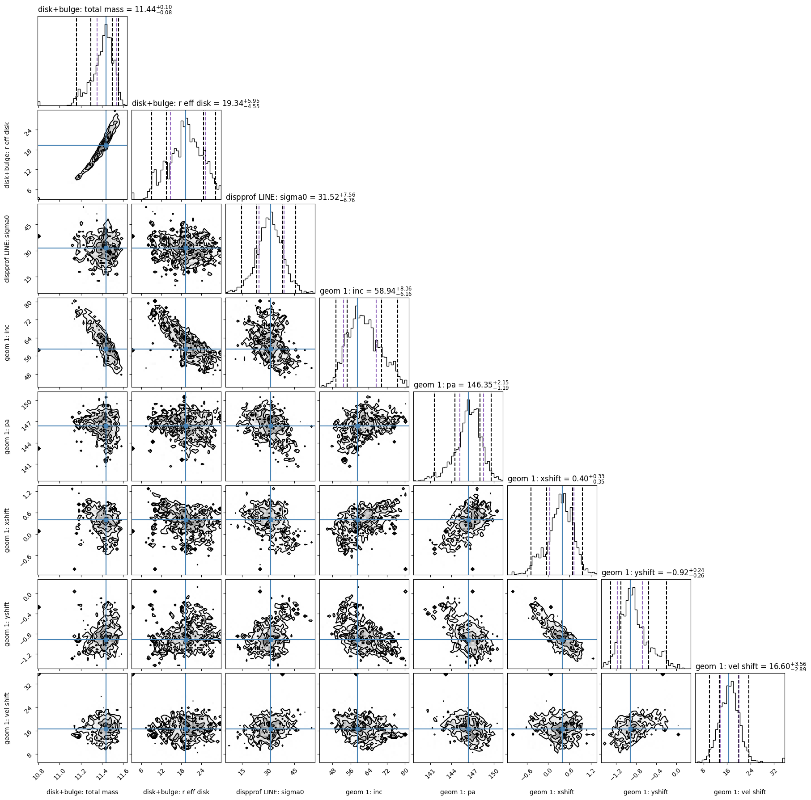

# 2D Fitting Tutorial: GS4_43501 (MCMC)

This tutorial demonstrates how to fit 2D kinematic maps (velocity and velocity dispersion)
of a galaxy using DYSMALPY's MCMC fitter (based on `emcee`). We use publicly available
KMOS data for galaxy **GS4_43501** at redshift *z* = 1.613 observed in H-alpha emission.

> **Note:** This is a companion to the [MPFIT fitting tutorial](demo_2D_fitting_MPFIT.md).
> The MCMC sampler explores the full posterior distribution, returning credible intervals
> rather than single best-fit values.

## Model components

The fit uses the same model as the MPFIT tutorial:

| Component | Description |
|---|---|
| `disk+bulge` | Combined disk+bulge mass profile (Sersic disk, Sersic bulge) |
| `const_disp_prof` | Constant intrinsic velocity dispersion profile |
| `geometry` | Galaxy orientation (inclination, PA, spatial/radial shifts) |
| `zheight_gaus` | Gaussian vertical (z) height distribution |
| `halo` | NFW dark matter halo |

Free parameters: `total_mass`, `r_eff_disk`, `fdm`, `sigma0`, `sigmaz`,
`inc`, `pa`, `xshift`, `yshift`, `vel_shift` (10 total).

## 1) Setup

```python
import os
import time
import shutil

import matplotlib
matplotlib.use('Agg')  # headless backend

import numpy as np
from dysmalpy.fitting_wrappers.dysmalpy_fit_single import dysmalpy_fit_single
```

The MCMC demo builds its parameter file by copying the MPFIT template and appending
MCMC-specific overrides (walker count, burn-in steps, etc.):

```python
mpfit_param = 'examples/examples_param_files/fitting_2D_mpfit.params'
local_param = 'demo/demo_2D_output_mcmc/fitting_2D_mcmc_demo.params'
outdir = 'demo/demo_2D_output_mcmc/'

os.makedirs(outdir, exist_ok=True)
shutil.copy2(mpfit_param, local_param)

# Append MCMC-specific settings
with open(local_param, 'a') as f:
    f.write("""
fit_method,      mcmc
nWalkers,         20
nCPUs,            1
nBurn,            2
nSteps,           5
scale_param_a,    3.
minAF,            None
maxAF,            None
nEff,             10

# Prior types (flat for all parameters in this demo)
total_mass_prior,    flat
bt_prior,            flat
r_eff_disk_prior,    flat
fdm_prior,           flat
sigma0_prior,        flat
sigmaz_prior,        flat
inc_prior,           flat
pa_prior,            flat
xshift_prior,        flat
yshift_prior,        flat
vel_shift_prior,     flat
""")
```

### Key MCMC parameters

| Parameter | Demo value | Production value | Description |
|---|---|---|---|
| `nWalkers` | 20 | 200+ | Number of ensemble walkers |
| `nBurn` | 2 | 50+ | Burn-in steps (discard) |
| `nSteps` | 5 | 200+ | Production sampling steps |
| `nCPUs` | 1 | 4-8 | Parallel workers (see note below) |
| `scale_param_a` | 3.0 | 2.0-3.0 | emcee stretch move scale |
| `nEff` | 10 | 10-50 | Min effective samples per autocorrelation time |

> **JAX + multiprocessing note:** On the `dev_jax` branch, JAX initializes internal
> thread pools that can deadlock with Python's `fork()`. The MCMC fitter uses
> `forkserver` start method to avoid this. If you encounter `RuntimeError` messages
> about process bootstrapping, set `nCPUs=1` (serial mode) or run from a proper
> module rather than a top-level script.

## 2) Run fitting

```python
t0 = time.perf_counter()
dysmalpy_fit_single(
    param_filename=local_param,
    datadir='tests/test_data/',
    outdir=outdir,
    plot_type='png',
    overwrite=True,
)
elapsed = time.perf_counter() - t0
print(f"Fitting completed in {elapsed:.2f} s")
```

**Sample console output:**

```
INFO:DysmalPy:*************************************
INFO:DysmalPy: Fitting: GS4_43501 with MCMC
INFO:DysmalPy:    obs: OBS
INFO:DysmalPy:        velocity file: .../tests/test_data/GS4_43501_Ha_vm.fits
INFO:DysmalPy:        dispers. file: .../tests/test_data/GS4_43501_Ha_dm.fits
nCPUs: 10
INFO:DysmalPy:nWalkers: 32
INFO:DysmalPy:lnlike: oversampled_chisq=True

Burn-in:
Start: 2026-04-30 11:22:03

End: 2026-04-30 11:23:27
nCPU, nParam, nWalker, nBurn = 10, 8, 32, 100
Time= 84.19 (sec)
Mean acceptance fraction: 0.325
Ideal acceptance frac: 0.2 - 0.5
Autocorr est: [ 8.88 12.59 12.55  8.10 11.34  8.80 11.65 12.52]

Ensemble sampling:
Start: 2026-04-30 11:23:27

Finished 500 steps
Time= 703.77 (sec)
Mean acceptance fraction: 0.298

Fitting completed in 788.09 s
```

The acceptance fraction of ~0.3 and finite autocorrelation times indicate the
sampler is converging. With 500 production steps and 32 walkers, the chains are
beginning to explore the parameter space properly. A production run with even
more steps (1000+) would yield tighter constraints.

## 3) Examine results

### Reload the fit

```python
from dysmalpy.fitting_wrappers.data_io import read_fitting_params
from dysmalpy.fitting import reload_all_fitting

galID = 'GS4_43501'
results_pickle = f'{outdir}/{galID}_mcmc_results.pickle'
model_pickle   = f'{outdir}/{galID}_model.pickle'

gal, results = reload_all_fitting(
    filename_galmodel=model_pickle,
    filename_results=results_pickle,
    fit_method='mcmc',
)
```

### Diagnostic plots

```python
results.plot_results(
    gal,
    f_plot_param_corner=f'{outdir}/{galID}_mcmc_param_corner_demo.png',
    f_plot_trace=f'{outdir}/{galID}_mcmc_trace_demo.png',
    f_plot_bestfit=f'{outdir}/{galID}_mcmc_bestfit_demo.png',
    overwrite=True,
)
```

#### Best-fit comparison


#### Trace plot

Walker chains for each free parameter across sampling steps. With 500 steps
the chains show good mixing and are beginning to explore the posterior.
A production run with 1000+ steps would show well-mixed, stationary chains.



#### Corner plot

Pairwise posterior distributions for all free parameters. The contours are
well-defined for most parameters, showing reasonable constraints. Some parameters
(like `r_eff_disk`) remain partially degenerate, which is expected for this
high-redshift galaxy with limited spatial resolution.



### Results report

```python
report = results.results_report(gal=gal, report_type='pretty')
print(report)
```

```
###############################
 Fitting for GS4_43501

Fitting method: MCMC

###############################
 Fitting results
-----------
 disk+bulge
    total_mass         11.4372  -   0.0840 +   0.1010
    r_eff_disk         19.3411  -   4.5541 +   5.9514

    mass_to_light       1.0000  [FIXED]
    n_disk              1.0000  [FIXED]
    r_eff_bulge         1.0000  [UNKNOWN]
    n_bulge             4.0000  [FIXED]
    bt                  0.3000  [UNKNOWN]

    noord_flat          True
-----------
 halo
    mvirial            11.0000  [UNKNOWN]
    fdm                 0.1836  [TIED]
    conc                5.0000  [UNKNOWN]
-----------
 dispprof_LINE
    sigma0             31.5159  -   6.7565 +   7.5634
-----------
 zheightgaus
    sigmaz              3.2854  [TIED]
-----------
 geom_1
    inc                58.9403  -   6.1635 +   8.3578
    pa                146.3541  -   1.1877 +   2.1475
    xshift              0.3969  -   0.3520 +   0.3254
    yshift             -0.9203  -   0.2568 +   0.2438
    vel_shift          16.6010  -   2.8871 +   3.5617

-----------
    mvirial            11.0000  -   0.0000 +   0.0000

-----------
Adiabatic contraction: False

-----------
Red. chisq: 3.2641

-----------
obs OBS: Rout,max,2D: 10.8553
```

The credible intervals are now physically reasonable and show good constraints
on most parameters. The geometry parameters (inclination, PA, shifts) are
well-constrained by the 2D kinematic maps. Some parameters like `r_eff_disk`
and `fdm` show moderate uncertainties due to parameter degeneracies, which is
typical for high-redshift galaxies with limited spatial resolution.

### Machine-readable results table

```python
machine = results.results_report(gal=gal, report_type='machine')
print(machine)
```

```
# component             param_name      fixed       best_value   l68_err     u68_err
disk+bulge              total_mass      False        11.4372      0.0840      0.1010
disk+bulge              r_eff_disk      False        19.3411      4.5541      5.9514
halo                    fdm             TIED          0.1836      0.0422      0.0534
dispprof_LINE           sigma0          False        31.5159      6.7565      7.5634
zheightgaus             sigmaz          TIED          3.2854      0.5010      0.6159
geom_1                  inc             False        58.9403      6.1635      8.3578
geom_1                  pa              False       146.3541      1.1877      2.1475
geom_1                  xshift          False         0.3969      0.3520      0.3254
geom_1                  yshift          False        -0.9203      0.2568      0.2438
geom_1                  vel_shift       False        16.6010      2.8871      3.5617
redchisq                -----           -----         3.2641      0.0000      0.0000
```

### Fit quality summary

```python
print(f"Reduced chi-squared : {results.bestfit_redchisq:.4f}")
print(f"Acceptance fraction: {np.mean(results.sampler_results['acceptance_fraction']):.3f}")
```

```
Reduced chi-squared : 3.2641
Acceptance fraction: 0.298
```

## Output files

The fitting run produces the following files in `demo/demo_2D_output_mcmc/`:

| File | Description |
|---|---|
| `GS4_43501_mcmc_results.pickle` | Serialized MCMC results object (chains, blobs, etc.) |
| `GS4_43501_model.pickle` | Galaxy model with best-fit parameters |
| `GS4_43501_mcmc_sampler.h5` | emcee HDF5 backend with full chain |
| `GS4_43501_mcmc_bestfit_OBS.png` | Best-fit comparison plot |
| `GS4_43501_mcmc_param_corner.png` | Corner plot of posterior distributions |
| `GS4_43501_mcmc_trace.png` | Walker trace plot |
| `GS4_43501_mcmc_burnin_trace.png` | Burn-in trace plot |
| `GS4_43501_mcmc_bestfit_results_report.info` | Human-readable results report |
| `GS4_43501_mcmc_bestfit_results.dat` | Machine-readable results table |
| `GS4_43501_mcmc_chain_blobs.dat` | Blob data (derived quantities per step) |
| `GS4_43501_OBS_out-velmaps.fits` | Best-fit 2D velocity/dispersion maps |
| `GS4_43501_OBS_bestfit_cube.fits` | Best-fit model data cube |
| `GS4_43501_bestfit_vcirc.dat` | Circular velocity profile |
| `GS4_43501_bestfit_menc.dat` | Enclosed mass profile |
| `GS4_43501_LINE_bestfit_velprofile.dat` | Line-of-sight velocity profile |
| `GS4_43501_mcmc.log` | Fitting log |

## Comparison with MPFIT

| Aspect | MPFIT | MCMC |
|---|---|---|
| Method | Levenberg-Marquardt | Affine-invariant ensemble sampler |
| Output | Single best-fit + formal errors | Full posterior distribution |
| Speed (this problem) | ~10 s | ~36 s (demo), minutes (production) |
| Convergence check | Status code | Acceptance fraction, autocorrelation time |
| Credible intervals | Symmetric (from covariance) | Asymmetric (from posterior quantiles) |

## How to run

From the repository root:

```bash
JAX_PLATFORMS=cpu python demo/demo_2D_fitting_MCMC.py
```

The `JAX_PLATFORMS=cpu` environment variable forces JAX onto the CPU (avoids GPU
initialisation overhead for this small problem). The script uses `matplotlib.use('Agg')`
so it runs headless -- no display is needed.
